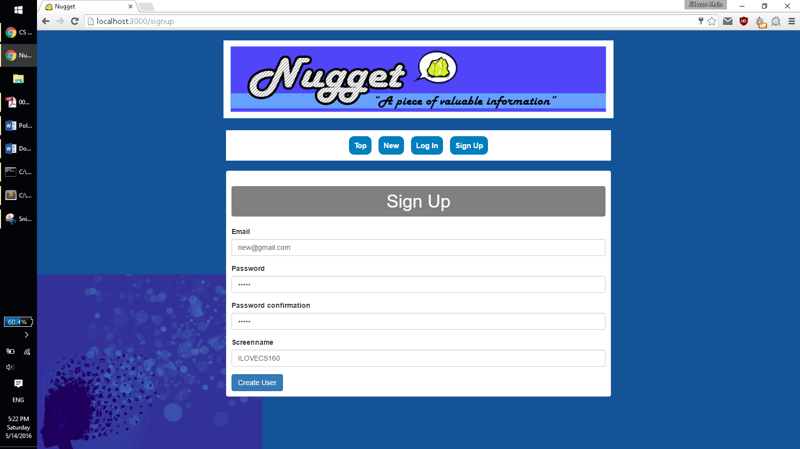
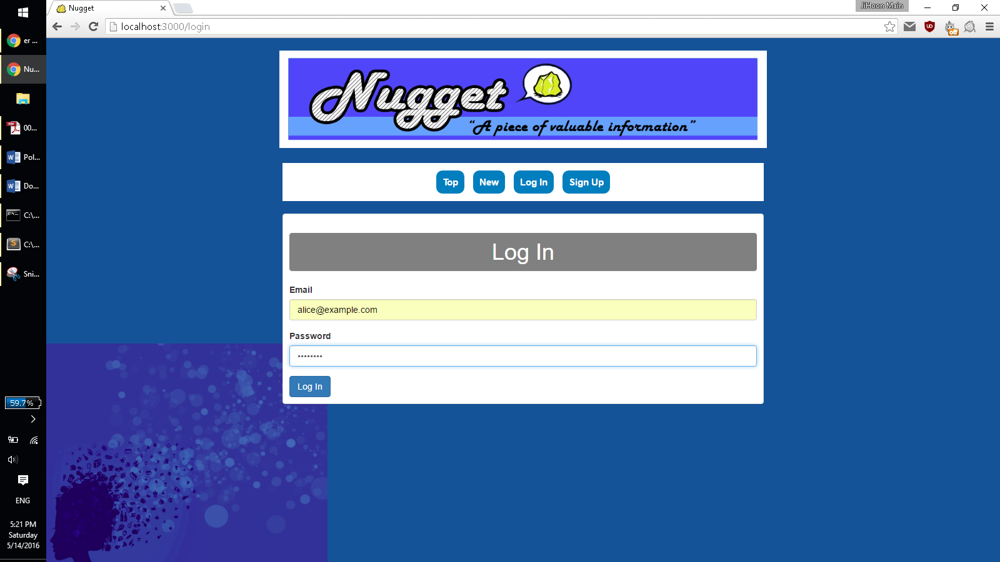

#Nugget

###Synopsis
This is a social networking app prototype that I made with Ruby on Rails.
Ruby 2.2
Rails 4.2

gems used: bootstrap, acts_as_votable, acts-as-taggable

This project was made in the span of about a month with a team of four people. Our goal was to create a project that would be simple yet have a wide range of functionality. Our three step plan for accomplishing this goal was first designing the site, then adding each layer of functionality, and finally improving the aesthetic of the site and deploying it.

###Screenshots of the functions
Sign-up/Log-in!

###Code Examples and Explanations
Functionalities we added were logging in and out, 