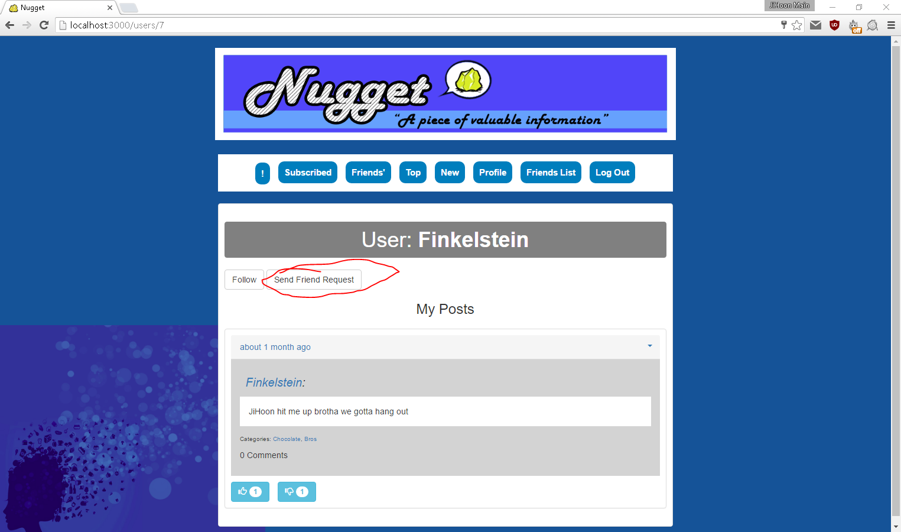
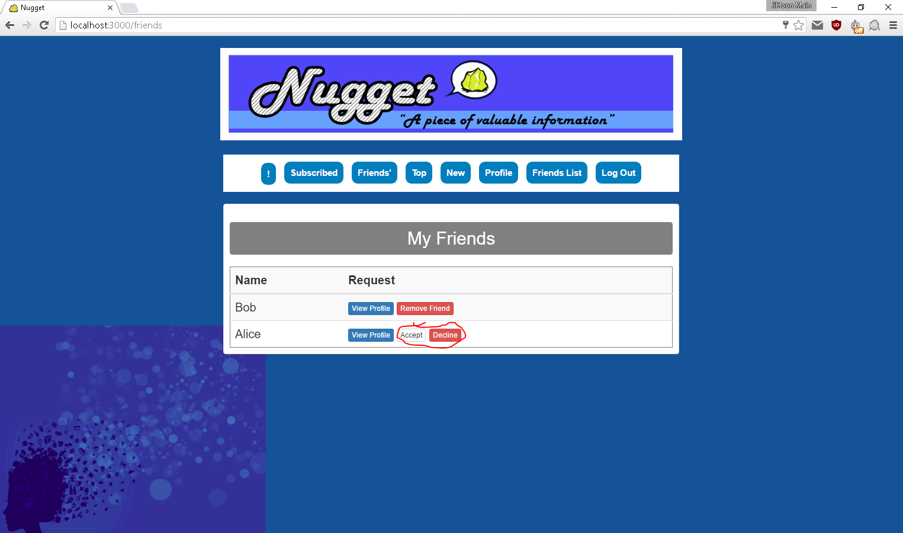
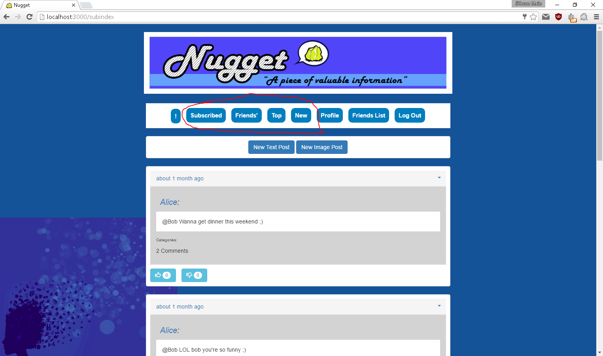
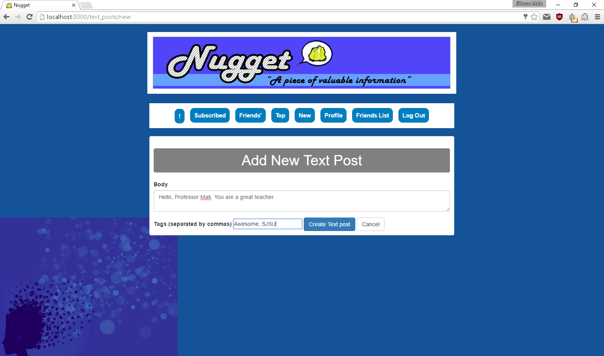
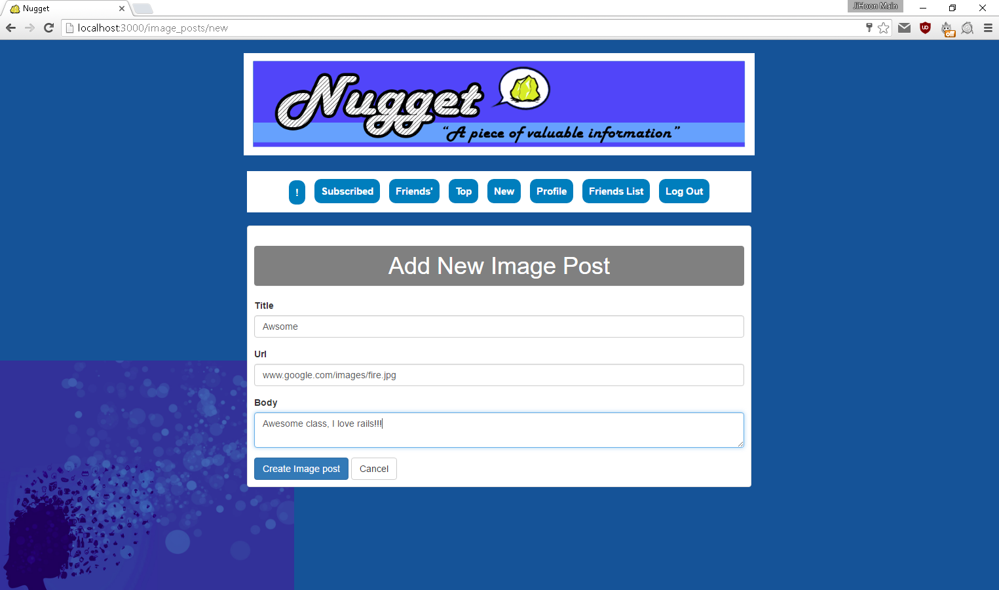
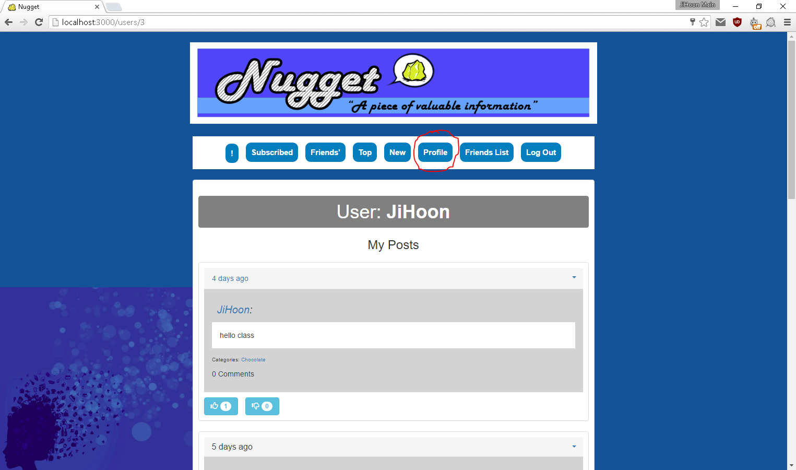
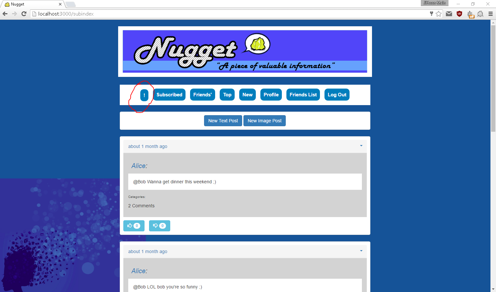

#Nugget

###Synopsis
This is a social networking app prototype that I made with Ruby on Rails.
Ruby 2.2
Rails 4.2

gems used: bootstrap, acts_as_votable, acts-as-taggable

This project was made in the span of about a month with a team of four people. Our goal was to create a project that would be simple yet have a wide range of functionality. Our three step plan for accomplishing this goal was first designing the site, then adding each layer of functionality, and finally improving the aesthetic of the site and deploying it.

###Screenshots and explanations of the functions
Sign-up/Log-in - normal process of signing up with a unique username and e-mail account and logging in to have your own session where you can make your own posts.

Add Friends or Follow - You can add friends and it will send them a request which they can accept or deny. You can also follow their posts without sending a friend request.

The front page initially consists of posts by users you are friends with or are following sorted by the most recent on top. You can also show only subscribed or only friends' posts, and sort by top (most voted) or new posts. The voting system, which was implemented with a gem, is a simple click to vote up or down system. The database logs how many upvotes or downvotes a post has and sorts them accordingly.

You can either add a text post or an image post. Along with this, you can add tags. These tags can be used on the front page to show posts only from that tag. 

Finally, you can view your own profile as well as others' profiles, showing their posts in order and having an option to add them or follow them. Your friends list will show all your current friends as well as your pending friend requests. The exclamation mark on the left is the notifications implemented with Javascript that notifies you when you have a new comment on your post or have gotten a new friend request.

###Code Examples and Explanations
Functionalities we added were logging in and out, 