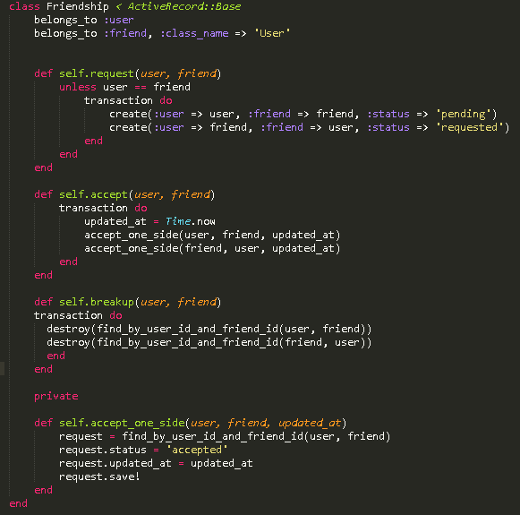
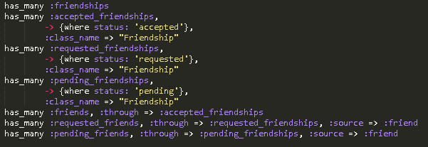
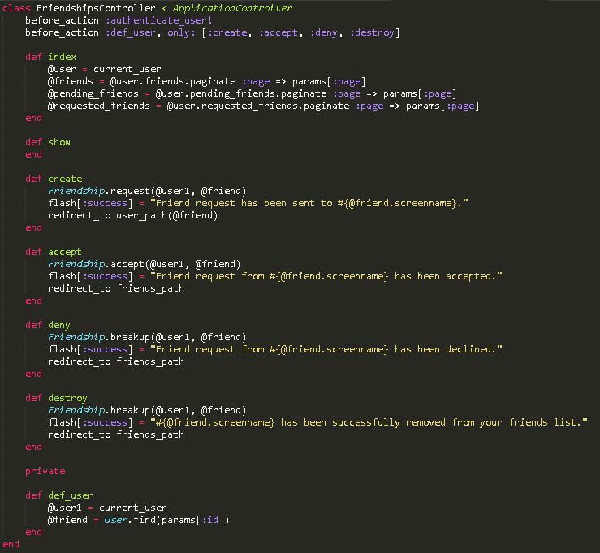
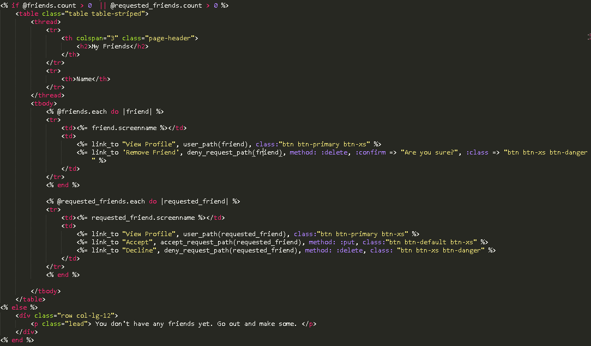
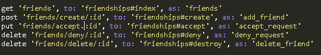
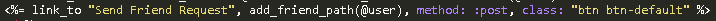

#Nugget

###Synopsis
This is a social networking app prototype that I made with Ruby on Rails.
Ruby 2.2
Rails 4.2

gems used: bootstrap, acts_as_votable, acts-as-taggable

This project was made in the span of about a month with a team of four people. Our goal was to create a project that would be simple yet have a wide range of functionality. Our three step plan for accomplishing this goal was first designing the site, then adding each layer of functionality, and finally improving the aesthetic of the site and deploying it.

###Screenshots and explanations of the functions
Sign-up/Log-in - normal process of signing up with a unique username and e-mail account and logging in to have your own session where you can make your own posts.

Add Friends or Follow - You can add friends and it will send them a request which they can accept or deny. You can also follow their posts without sending a friend request.

The front page initially consists of posts by users you are friends with or are following sorted by the most recent on top. You can also show only subscribed or only friends' posts, and sort by top (most voted) or new posts. The voting system, which was implemented with a gem, is a simple click to vote up or down system. The database logs how many upvotes or downvotes a post has and sorts them accordingly.

You can either add a text post or an image post. Along with this, you can add tags. These tags can be used on the front page to show posts only from that tag. 

Finally, you can view your own profile as well as others' profiles, showing their posts in order and having an option to add them or follow them. Your friends list will show all your current friends as well as your pending friend requests. The exclamation mark on the left is the notifications implemented with Javascript that notifies you when you have a new comment on your post or have gotten a new friend request.

###Code Examples and Explanations
I will go over one of the functions and describe the code as well as some of the obstacles that I ran into.

Our use case will be different aspects of Friends
•	Requesting a friendship
•	Accepting a friendship
•	Denying a friendship
•	Deleting a friend

Explaining the code:

 

First up is the Model. This is where the associations are made along with methods that can be used by the controller. Here, it is very simple. The database for “friendship” consists of user_id, friend_id, and status (along with some dates). So we need to say that the friendship belongs to both the user and the friend, who belongs to the class User. We have four methods here. Self.request requests a friendship by setting the status of the person who sent the request to pending and the status of the person who is receiving the request to requested. We need to do this because we have to differentiate between who is doing the sending and who is receiving the request. Self.accept changes both to accepted through a private helper method called self.accept_one_side, which updates the updated_at to the correct time in the database and saves the data to the database. Finally, self.breakup destroys both instances of the friendship. 

In user.rb, we need to define some variables.

We need to create three different types of friendships and friends so we can filter them out later on. As discussed earlier, requested friends/friendships are requests from others, and pending requests are ones that you sent out. Once the request is accepted by the appropriate side, the relationship becomes simply friends. 

 
Here is the controller. The index simply sets the variables so we can call them later, listing out each of the three types of friends so we can use them later. ‘create’ sends the initial friend request. Note that it calls the method from the model. It takes two arguments, the sender and the receiver. Accept, deny, and destroy are the same, except with the other methods from the Friendship model. Also note that in def_user, which is defined before the main methods, it only takes in one parameter, which is because one of them is always going to be the current user.

 
Here is friendships/index.html.erb.
This is the friend list. It first checks if there are any friends are requested friends to list. If there is, it posts the “My Friends” header, then lists each friend in a table with the option to view their profile and remove the friend, or if they are requested friends, instead of removing, accepting or declining the friend request. At the end in the else statement, it means that there are no friends to be displayed, and displays a message. The @friends and @requested_friends variables are from the controller, and it just has all the appropriate friends in an array. The do loops are going through them and printing out the necessary links for each one. The paths such as deny_request_path are defined in the routes file.

 
Here in the routes file, we must define all the routes that we use for our friends. We have to put the correct type of HTTP command (get/put/post/delete) or else it won’t work. The “to:” goes to the controller method, and the “as:” renames the route so we can reference it in our view.

 This line goes in the show.html.erb file for the user, because we want a link in the user’s profile that allows another use to add them as a friend. It only shows up if they are not already a friend and obviously does not show up on your own profile. 

